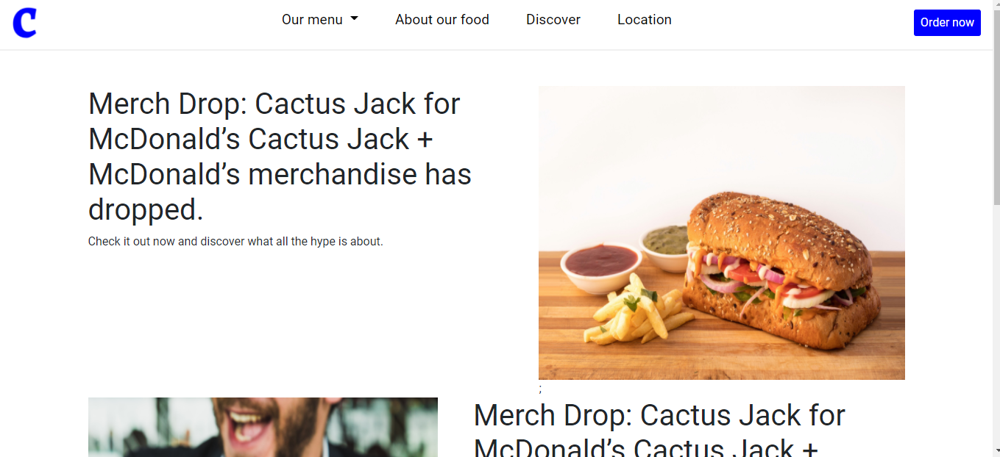

# Restaurant page 

> This is a Microverse JavaScript Project

> Restaurant page!

## Description

Restaurant page is a javascript project that demonstrates use of webpack to bundle javascript modules into a single out put, a main javascript file. I used npm to install webpack, webpack cli. Created different folders to host the contents.

## Live version

Heres a live <a href="https://raw.githack.com/imhilla/restaurant-page/feature/dist/index.html#">link</a>

## Features

In this project, the following actions were done;

### Functionalities added
- Set up the project with a HTML, CSS and Javascript files and get the Git repo all set up.
- Created the gameboard module.
- Created the players factory functions.
- Created functions to render the game board and control the logics involved in the game. 

## Built with

- HTML
- Git
- CSS
- JavaScript
- Shields.io

## Authors

Reach out to us!

👤 **Hillary Kiptoo**

- LinkedIn: [Hillary Kiptoo](https://www.linkedin.com/in/hillarykiptoo)
- Github: [@imhilla](https://github.com/imhilla)
- Twitter: [@hillarykiptoo](https://twitter.com/hillarykiptoo_)

👤 **Muhammad Fahad Umer**

- LinkedIn: [Muhammad Fahad](https://www.linkedin.com/in/hillarykiptoo)
- Github: [@MFahadUmer](https://github.com/MFahadUmer)
- Twitter: [@engfahadumer](https://twitter.com/@engfahadumer)

## Contributing 🤝

Contributions, issues, and feature requests are welcome!

Feel free to check the [issues page](https://github.com/MFahadUmer/Library/issues).

## Acknowledgments

- Thanks to Microverse for its support!

## Show your support

Give a ⭐️ if you like this project!

## License

- **[MIT license](http://opensource.org/licenses/mit-license.php)**
